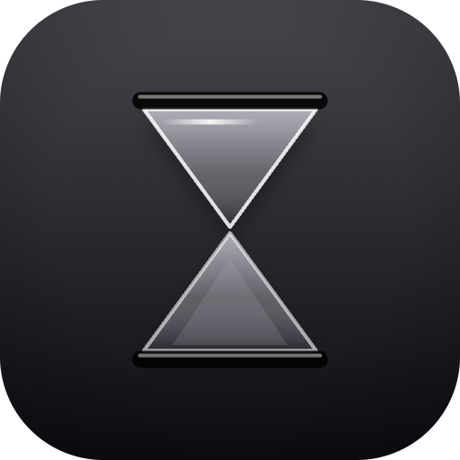

<p align="center">
  
</p>

<h1 align="center">Hourglass</h1>

<p align="center">
  Native macOS search and analytics for your iMessage history.<br>
  Everything runs locally — nothing is uploaded, sent, or shared.
</p>

<p align="center">
  <a href="https://github.com/ammesatyajit/hourglass/releases/latest/download/Hourglass.dmg"><strong>Download for macOS →</strong></a>
  &nbsp;·&nbsp;
  <a href="https://github.com/ammesatyajit/hourglass/releases">Changelog</a>
  &nbsp;·&nbsp;
  <a href="LICENSE">MIT License</a>
</p>

<p align="center">
  
  
  
  
</p>

---

## What it does

- **Sub-second search** across every message you've ever sent or received — operators like `with:Henry`, `last:7d`, `type:image`, regex, AND, OR
- **Spotlight-style hotkey panel** — `⌃⌥Space` from anywhere (rebindable in Settings)
- **Dashboard analytics** — top contacts, sent/received over time, top group chats, brushable timeline
- **Optional natural-language search** — local Qwen 2.5 via MLX, fully offline after a one-time model download
- **Signed, notarized, sandbox-friendly** — clean Gatekeeper install, Full Disk Access is the only permission

## Build it yourself

```bash
brew install xcodegen xcbeautify create-dmg
git clone https://github.com/ammesatyajit/hourglass.git
cd hourglass
./scripts/generate.sh     # XcodeGen → Hourglass.xcodeproj
./scripts/build.sh        # Debug build → build/Build/Products/Debug/Hourglass.app
./scripts/test.sh         # ~500 tests, ~1 second
open Hourglass.xcodeproj  # or just iterate in Xcode
```

Requires **macOS 15+** and **Xcode 26+**. Apple Silicon recommended.

Or hand the repo to a coding agent and say *"set this up locally and run the tests."* The project is XcodeGen + SPM with a hermetic test suite (synthetic fixture, no real data), so most agents figure it out.

## Contributing

PRs welcome. Run `./scripts/test.sh` before sending; everything should be green. For larger changes, file an issue first so we can talk about shape.

The one hard rule: **no new network calls.** Local-only is the core promise. The one existing outbound is the optional first-run Hugging Face model download for NL search — and it's gated/opt-in.

## License

[MIT](LICENSE) — fork it, audit it, ship your own version.
